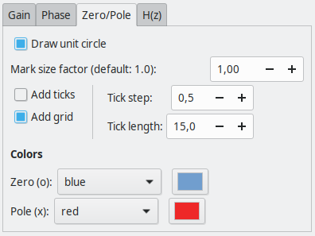

# bodePlot

This extension will assist you creating Bode plot of rational transfer functions in [Inkscape](https://inkscape.org/).


## Main features
The main features of this extension are

- Both continuous and discrete time systems are accepted
- The input is the coefficients of the rational transfer function H(s) or H(z)
- adjustable frequency units
- Gain plot in linear, log10 or dB scales
- Phase plot in degree or radians
- Optional zero/pole plot
- Optional LaTeX support

## Current version

Compatibility table

|  Inkscape        |  bodePlot       | inkscapeMadeEasy | Receive updates?|
|------------------|-----------------|------------------|-----------------|
|       1.0        | 1.0 (latest)    |   1.0 (latest)   | YES             |
| 0.48, 0.91, 0.92 | -               |   -              | -               |


**Latest version:** The latest version of **bodePlot** is **1.0**. This version is compatible with Inkscape 1.0 and up only. It is **incompatible** with older Inkscape versions!

# Installation and requirements

Installation procedures for latest versions is described below.

## Requirements

- You will need [inkscapeMadeEasy](https://github.com/fsmMLK/inkscapeMadeEasy) plugin installed. Check the compatibility table above to know the version you need.

## Installation procedure (v1.0 only)

**bodePlot** was developed using Inkscape 1.0 in Linux (Kubuntu 18.04). It should work in different OSs too as long as all requirements are met.

1. Install [inkscapeMadeEasy](https://github.com/fsmMLK/inkscapeMadeEasy), **version 1.0** (latest). Follow the instructions in the manual page. **Note:** LaTeX text is used in **bodePlot** if the support is activated (nicer results), otherwise regular text elements will be used.

2. **bodePlot** installation

    1. Go to Inkscape's extension directory with a file browser. Your inkscape extension directory can be accessed by opening Inkscape and selecting ``Edit > Preferences > System``. Look for the item **User Extensions**  field. There is a button on the right of the field  that will open a file explorer window in that specific folder.

    2. Create a subfolder in the extension directory with the name ``bodePlot``. **Important:**  Be careful with upper and lower case letters. You must write as presented above.

    3. Download **bodePlot** files and place them inside the directory you just created.

       You don't have to copy all files from Github. The files you will need are inside the ``latest`` folder. In the end you must have the following files and directories in your Inkscape extension directory.

       **LaTeX users:** You can add macros to ``inkscapeMadeEasy/basicLatexPackages.tex``. The same macros will be accessible by all plugins that employ inkscapeMadeEasy.

        ```
        inkscape
         ┣━━extensions
         ┋   ┣━━ inkscapeMadeEasy      <-- inkscapeMadeEasy folder
             ┃    ┣━━ inkscapeMadeEasy_Base.py
             ┃    ┣━━ inkscapeMadeEasy_Draw.py
             ┃    ┣━━ inkscapeMadeEasy_Plot.py
             ┃    ┗━━ basicLatexPackages.tex
             ┃
             ┣━━ textext               <-- texText folder (if you installed textText)
             ┃    ┋
             ┃
             ┣━━ bodePlot        <-- bodePlot folder
             ┋    ┣━━ bodePlot_S.inx
                  ┣━━ bodePlot_Z.inx
                  ┗━━ bodePlot.py
        
        NOTE: You might have other sub folders inside the extensions directory. They don't interfere with the plugin.
        ```

# Usage

This extension is presented in two menu entries: **Bode Plot H(s)** and **Bode Plot H(z)**. Both can be found under `extensions > fsmMLK > Plot 2D > Bode plot` menu.

The first is used to create bode plots of continuous time transfer functions H(s). The second is used to create bode plots of discrete time transfer functions H(z).

Each entry has two tabs, **Bode data** and  **Config**. The first is used to specify the transfer function and the second is used to configure the plots.

**Bode Plot H(s)** and **Bode Plot H(z)** menu entries have almost the same adjustable parameters, there are just a few differences. They will be presented together in the following sections and any differences will be highlighted.

## Bode Data


Here you can define your function and set the frequency axis. 

### Transfer function section

**Numerator/Denominator:** Coefficients of the numerator. Separate values with spaces or commas. The coefficients must be written in decreasing powers of s or z. See figure below.


**Number of points:** Number of points where the function will be evaluated within the limits.The points will be logarithmically distributed within the frequency limits (same number of points per decade).

### Plots section

Here you can select which plots to create. You can create gain, phase, and zeros/poles plots. You can also write the expression of the transfer function H(s) or H(z). 

### Frequency config section

**Range [continuous time only]:** Set the range of frequencies of the plots.

   - **Continuous time:** The limits are defined as a powers 1O^n, where n minimum and maximum are defined by the user in the fields on the side. The unit of the frequency depends on the selected unit (see below).
      
   - **Discrete time:** You have two options:

      - **0 to Fs:** Range between 0 and the sampling frequency (Fs)
      - **0 to Fs/2:** Range between 0 and Nyquist frequency (Fs/2)
   


**Label:** Label to be used as frequency symbol (see figures below). You can chose lowercase (f or ω) or uppercase (F or Ω), or a custom symbol. You can use any LaTeX code as custom symbol (LaTeX command will be placed in math mode). **Attention:** Changing the label will NOT change between the type of frequency (regular, angular). For that see **Unit** below.

**Unit:** Set the type of frequency. 

   - **Continuous time:** Regular (Hertz) or angular (rad/s). Changing the unit will change default symbols used for labeling.
      - Unit=Hz --> f or F
      - Unit=rad/s --> ω or Ω


     
   - **Discrete time:** You have two options:
      - **rad/sample**: π represents the Nyquist frequency  and 2π represents the sampling frequency. 
      - **normalized**: 1.0 represents the Nyquist frequency  and 2.0 represents the sampling frequency.


**Add ticks:** Draw tick marks with associated values. 

**Add grid:** Draw grid lines. The grid lines will be placed dividing each decade in 10 parts

**Tick length:** The distance between tick marks, in units of your canvas. See image below.

   - **Continuous time:** The size of each decade, in units of your canvas.
   - **Discrete time:** The distance between consecutive ticks, in units of your canvas.


**Tick step [discrete time only]:** Tick mark interval, in units of your chart. This option does not affect log scale.


## Config tab


### General config section


**General aspect factor:** General aspect ratio between line widths and text height. I designed this extension to have an overall aspect ratio that "looks nice". It is a function of X and Y tick lengths. With this control you can scale both line width and text height. The defauls value is 1.0.


### Plot config section

The parameters in this section controls gain, phase, zero/pole plots and the transfer function.

This tab contains four subtabs, *Gain*, *Phase*, *Zero/Pole*, and *H(s)* (or *H(z)*).


### Gain subtab


**Label:** Label of the axis. You can chose between |H(...)| or a custom label. You can use any LaTeX code as custom symbol (LaTeX command will be placed in math mode).


**Gain plot limit:** Upper limit of the gain plot. The plot will be clipped at this value. useful when you experience ressonance. **ATTENTION:** The plot is generated by evaluating the function in the input range and connecting them with a polyline. If the function is clipped, your plot will present a line connecting both sides. **In such cases, please check your plot!**


**Add ticks:** Draw tick marks with associated values.

**Add grid:** Draw grid lines.

**Scale:** Chose the scale of the gain axis.


**Tick step:** Tick mark interval, in units of your chart. This option does not affect log10 scale. See *Frequency config section* for examples.

**Tick length:** The distance between tick marks, in units of your canvas. See image below.

   - **Log10 scale:** The size of each decade, in units of your canvas.
   - **linear and dB scales:** The distance between consecutive ticks, in units of your canvas.

### Phase subtab


**Label:** Label of the axis. You can chose between ∠H(...) or a custom label. You can use any LaTeX code as custom symbol (LaTeX command will be placed in math mode).


**Add ticks:** Draw tick marks with associated values.

**Add grid:** Draw grid lines.

**Unit:** Chose the unit of the phase axis.


**Tick step:** Tick mark interval. This value is in degrees, even if you chose another unit. It will be converted accordingly.

**Tick length:** The distance between tick marks, in units of your canvas.


### Zero/Pole subtab



**Draw unit circle [discrete time only]:** Add the unit circle in the plot.


**Mark size factor:** Adjuts the size of the  zero and pole markers. The defauls value is 1.0.


**Add ticks:** Draw tick marks with associated values.

**Add grid:** Draw grid lines.

**Tick step:** Tick mark interval.

**Tick length:** The distance between tick marks, in units of your canvas.

**Colors:**

This section controls the colors of the zero (o) and poles (x) markers.

In both cases, you have two options in the `Color` drop down menu:

  - You can select the predefined colors. They are presented below


  - You can select **use color picker** to choose the color from the color picker widget just to the right of the drop down menu. **Attention:** the color selected in the color picker widget will be considered **ONLY** if you select **use color picker** in the drop down menu. 

### H(s) and H(z) subtab


Here you can control how the transfer function expression will appear.

**Precision:** Number of decimal places used for the coefficients.

**Simplifications:** The figures below present optional simplifications of the expression


**Normalize denominator:** If selected, normalize the coefficients such that the largest power in the denominator is unitary. 


# Observations

 - The axes will be created in the center of your screen.
